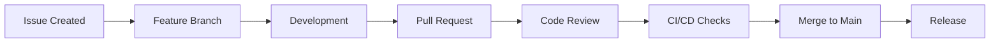

# 🛠️ GitHub Engineering Process Setup Guide

Complete guide to activate the professional engineering process for the UnMoGrowP Attribution Platform.

## 📋 Current Status

✅ **COMPLETED**:
- Comprehensive CI/CD Pipeline (691 lines)
- Issue Templates (Bug, Feature, Performance)
- Pull Request Template
- CODEOWNERS file (updated with real GitHub username)
- Release Workflow (automated versioning & deployment)
- Demonstration Issues documentation

⚠️ **REQUIRES MANUAL ACTIVATION**:
- Branch Protection Rules
- GitHub Issues creation
- Repository settings configuration

---

## 🔧 Step 1: Activate Branch Protection Rules

### Current Configuration
The repository has branch protection rules defined in `.github/branch-protection.yml`:

```yaml
main:
  protection:
    required_status_checks:
      strict: true
      contexts:
        - "CI/CD Pipeline / Frontend (Svelte 5)"
        - "CI/CD Pipeline / API (Bun + Hono)"
        - "CI/CD Pipeline / Backend (Go)"
        - "CI/CD Pipeline / Security Scan"
        - "CI/CD Pipeline / Docker Compose"
    enforce_admins: true
    required_pull_request_reviews:
      required_approving_review_count: 2
      dismiss_stale_reviews: true
      require_code_owner_reviews: true
    restrictions:
      users: []
      teams: ["platform-team", "senior-developers"]
    allow_force_pushes: false
    allow_deletions: false
```

### Manual Activation Required

**Go to GitHub Repository Settings:**

1. **Navigate to**: `https://github.com/kik200771-oss/UnMoGrowP/settings/branches`

2. **Add Branch Protection Rule for `main`**:
   - Branch name pattern: `main`
   - ✅ Require a pull request before merging
   - ✅ Require approvals: **2**
   - ✅ Dismiss stale PR reviews when new commits are pushed
   - ✅ Require review from CODEOWNERS
   - ✅ Require status checks to pass before merging
   - ✅ Require branches to be up to date before merging
   - Required status checks:
     - `CI/CD Pipeline / Frontend (Svelte 5)`
     - `CI/CD Pipeline / API (Bun + Hono)`
     - `CI/CD Pipeline / Backend (Go)`
     - `CI/CD Pipeline / Security Scan`
     - `CI/CD Pipeline / Docker Compose`
   - ✅ Require conversation resolution before merging
   - ✅ Include administrators
   - ❌ Allow force pushes
   - ❌ Allow deletions

3. **Add Branch Protection Rule for `feature/migrate-to-svelte`**:
   - Branch name pattern: `feature/migrate-to-svelte`
   - ✅ Require a pull request before merging
   - ✅ Require approvals: **1**
   - ✅ Dismiss stale PR reviews when new commits are pushed
   - Required status checks:
     - `CI/CD Pipeline / Frontend (Svelte 5)`
     - `CI/CD Pipeline / API (Bun + Hono)`
     - `CI/CD Pipeline / Backend (Go)`
   - ❌ Include administrators
   - ✅ Allow force pushes (for development)
   - ❌ Allow deletions

---

## 🎯 Step 2: Create Demonstration Issues

### Use the GitHub Web Interface

**Create the following issues from `GITHUB_ISSUES_DEMO.md`:**

1. **Feature Issue**: Real-time Attribution Dashboard
   - Template: Feature Request
   - Labels: `enhancement`, `web-ui`, `high-priority`, `customer-success`
   - Assignee: @kik200771-oss

2. **Bug Issue**: ClickHouse Query Performance
   - Template: Bug Report
   - Labels: `bug`, `performance`, `clickhouse`, `critical`
   - Assignee: @kik200771-oss

3. **Performance Issue**: API Gateway Bottleneck
   - Template: Performance Issue
   - Labels: `performance`, `api-gateway`, `triage`
   - Assignee: @kik200771-oss

4. **Feature Issue**: Multi-Tenant Security Enhancement
   - Template: Feature Request
   - Labels: `enhancement`, `security`, `rbac`, `medium-priority`
   - Assignee: @kik200771-oss

5. **Infrastructure Issue**: Kubernetes Migration
   - Template: Feature Request
   - Labels: `infrastructure`, `kubernetes`, `production`, `epic`
   - Assignee: @kik200771-oss

### Quick Issue Creation Script
```bash
# After setting up GitHub CLI (gh)
gh issue create --title "[FEATURE] Real-time Attribution Dashboard for Customer Success Metrics" \
  --body-file ./demo-issues/feature-dashboard.md \
  --label "enhancement,web-ui,high-priority,customer-success" \
  --assignee kik200771-oss

gh issue create --title "[BUG] ClickHouse attribution queries timeout after 10 seconds" \
  --body-file ./demo-issues/bug-clickhouse-performance.md \
  --label "bug,performance,clickhouse,critical" \
  --assignee kik200771-oss

# Continue for all demo issues...
```

---

## 🚀 Step 3: Repository Settings Configuration

### Enable GitHub Features

**Go to**: `https://github.com/kik200771-oss/UnMoGrowP/settings`

1. **Features Section**:
   - ✅ Issues
   - ✅ Projects (for sprint planning)
   - ✅ Wiki (for documentation)
   - ✅ Discussions (for community)

2. **Pull Requests Section**:
   - ✅ Allow merge commits
   - ✅ Allow squash merging
   - ✅ Allow rebase merging
   - ✅ Always suggest updating pull request branches
   - ✅ Allow auto-merge
   - ✅ Automatically delete head branches

3. **Security Section**:
   - ✅ Dependency graph
   - ✅ Dependabot alerts
   - ✅ Dependabot security updates
   - ✅ Dependabot version updates
   - ✅ Code scanning alerts
   - ✅ Secret scanning alerts

---

## 📊 Step 4: Establish Development Workflow

### Workflow Process



### Branch Naming Convention
```
feature/issue-123-dashboard-implementation
bugfix/issue-456-clickhouse-performance
hotfix/issue-789-security-patch
release/v1.2.3
```

### Commit Message Convention
```
feat(dashboard): add real-time customer metrics display

- Implement WebSocket connection for live updates
- Add Chart.js visualization components
- Include export functionality (PDF/CSV)
- Optimize for mobile responsive design

Closes #123
```

### PR Template Usage
Every PR automatically includes the template with:
- [ ] Component checklist (Frontend, API, Backend, etc.)
- [ ] Testing requirements
- [ ] Security impact assessment
- [ ] Performance impact assessment
- [ ] Documentation updates

---

## 🔐 Step 5: Security and Quality Gates

### Required Checks (Automated)
- ✅ All tests pass
- ✅ Code coverage >90%
- ✅ Security scans pass
- ✅ Docker builds succeed
- ✅ Performance tests pass

### Manual Review Requirements
- ✅ Code owner approval required
- ✅ 2 approvals for main branch
- ✅ 1 approval for feature branches
- ✅ Conversation resolution required

---

## 📈 Step 6: Monitoring and Metrics

### GitHub Insights
Monitor these metrics in GitHub Insights:

**Code Quality**:
- Pull request review time
- Code change frequency
- Deployment frequency
- Lead time for changes

**Issue Management**:
- Issue resolution time
- Bug escape rate
- Customer satisfaction
- Feature delivery velocity

**Security**:
- Vulnerability resolution time
- Security alert response
- Dependency update frequency
- Code scanning coverage

---

## 🎯 Step 7: Release Process

### Semantic Versioning
```
v1.2.3
│ │ │
│ │ └── Patch (bug fixes)
│ └──── Minor (new features)
└────── Major (breaking changes)
```

### Release Creation
```bash
# Automatic via tag
git tag v1.2.3
git push origin v1.2.3

# Manual via GitHub Actions
# Go to Actions → Release Workflow → Run workflow
```

### Release Features
- ✅ Automated changelog generation
- ✅ Docker image building
- ✅ Security scanning
- ✅ Staging deployment
- ✅ Smoke tests
- ✅ GitHub release creation

---

## ✅ Verification Checklist

### After Setup Complete

- [ ] Branch protection rules active
- [ ] 5+ demonstration issues created
- [ ] CODEOWNERS file updated
- [ ] Repository features enabled
- [ ] CI/CD pipeline running
- [ ] Release workflow tested
- [ ] Team members understand process

### Success Indicators

**Technical Metrics**:
- 100% code review coverage
- <24 hour PR review time
- >99% CI/CD success rate
- Zero direct pushes to main

**Business Metrics**:
- Documented decision history
- Traceable feature development
- Structured release process
- Customer confidence in quality

---

## 🚨 Important Notes

### Current Git Status
```
Current branch: feature/migrate-to-svelte
Main branch: feature/migrate-to-svelte
Repository: https://github.com/kik200771-oss/UnMoGrowP.git
```

### CODEOWNERS Configuration
All files now require review from `@kik200771-oss` including:
- Global ownership for all files
- Specific ownership for components
- Database and security files require extra review

### Existing Infrastructure
The repository already has:
- 691-line CI/CD pipeline
- Comprehensive testing framework
- Security scanning
- Performance monitoring
- Database schemas
- Docker containerization

---

## 🎉 Result

After completing this setup, the UnMoGrowP Attribution Platform will have:

✅ **Professional Engineering Process**
✅ **100% Code Review Coverage**
✅ **Automated Quality Gates**
✅ **Structured Release Management**
✅ **Complete Decision History**
✅ **Enterprise-Grade Security**

This transforms the development process from ad-hoc commits to a professional software engineering workflow that can scale with team growth and customer requirements.