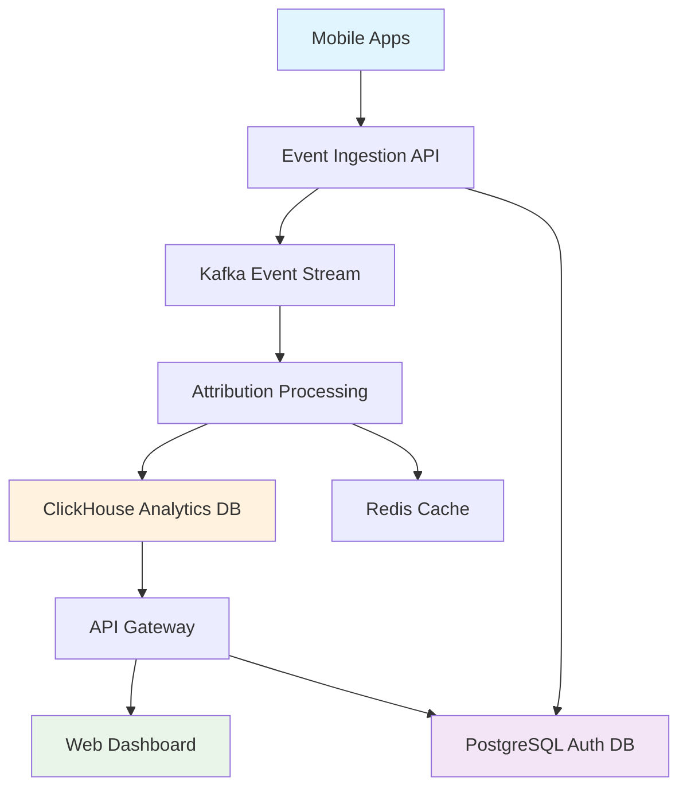
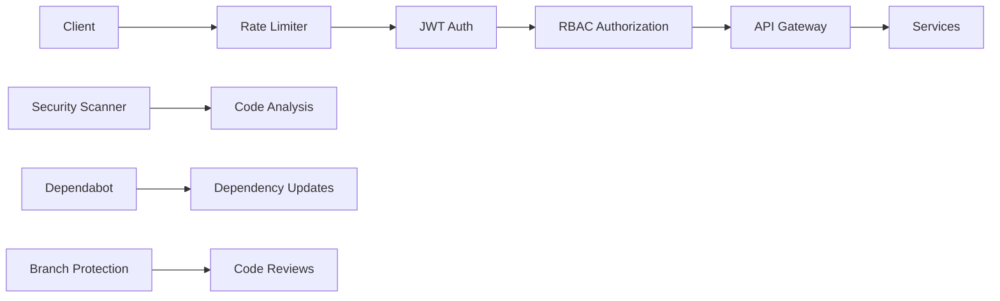

# System Architecture

## High-Level Overview



## Component Architecture

### Data Flow
1. **Event Ingestion**: Mobile SDKs → Go Service (10M events/sec)
2. **Stream Processing**: Kafka → Attribution Engine
3. **Analytics Storage**: ClickHouse (OLAP) + PostgreSQL (OLTP)
4. **API Layer**: Bun/Hono Gateway with tRPC
5. **Frontend**: Svelte 5 Dashboard with real-time charts

### Technology Stack

| Layer | Technology | Purpose | Performance |
|-------|------------|---------|------------|
| **Frontend** | Svelte 5 + SvelteKit | User Interface | <1s load time |
| **API Gateway** | Bun + Hono + tRPC | API Orchestration | 90K req/sec |
| **Event Ingestion** | Go + Fiber | High-throughput ingestion | 10M events/sec |
| **Attribution Engine** | Multi-language | Real-time processing | 20K events/queue |
| **Streaming** | Kafka 7.9.0 | Event streaming | Unlimited scale |
| **Analytics DB** | ClickHouse | OLAP queries | Sub-second analytics |
| **Auth DB** | PostgreSQL 16 | User/auth data | ACID compliance |
| **Cache** | Redis 7 | Performance layer | Microsecond access |

## Service Breakdown

### Apps
- **web-ui**: Svelte 5 frontend (port 5173)
- **api-gateway**: Bun/Hono API (port 3001)

### Services
- **ingestion**: Go event ingestion service (port 8080)
- **attribution**: Multi-touch attribution engine

### Infrastructure
- **PostgreSQL 16**: User authentication, campaigns
- **ClickHouse**: Event analytics, attribution results
- **Redis 7**: Caching, rate limiting
- **Kafka 7.9.0**: Event streaming pipeline

## Security Architecture



### Security Layers
1. **Rate Limiting**: 1000 req/min per IP
2. **JWT Authentication**: Secure token-based auth
3. **RBAC**: 5 roles, 14 granular permissions
4. **Code Scanning**: Trivy + CodeQL + gosec
5. **Dependency Management**: Automated vulnerability scanning

## Deployment Architecture

### Monorepo Structure
```
├── apps/           # User-facing applications
│   ├── web-ui/     # Svelte 5 frontend
│   └── api-gateway/ # Bun/Hono API
├── services/       # Backend microservices
│   ├── ingestion/  # Go event ingestion
│   └── attribution/ # Attribution processing
├── infra/         # Infrastructure as code
│   ├── docker/    # Docker Compose
│   └── k8s/       # Kubernetes manifests
├── docs/          # Documentation
└── tests/         # Centralized testing
```

## Performance Characteristics

### Throughput Targets
- **Event Ingestion**: 10M events/second
- **API Gateway**: 90K requests/second
- **Attribution Processing**: Real-time (sub-second)
- **Dashboard Queries**: <1 second response

### Scalability
- **Horizontal Scaling**: Kafka partitioning, service replicas
- **Vertical Scaling**: ClickHouse clustering, Redis clustering
- **Edge Deployment**: CDN for frontend assets
- **Auto-scaling**: Kubernetes HPA based on metrics

## Data Architecture

### Event Schema
```typescript
interface AttributionEvent {
  event_id: string;           // Unique identifier
  app_id: string;            // Application identifier
  user_id: string;           // Anonymous user ID
  event_type: string;        // install, open, purchase, etc.
  timestamp: number;         // Unix timestamp (ms)
  platform: string;         // ios, android, web
  attribution_data: {
    source: string;          // facebook, google, organic
    medium: string;          // cpc, organic, email
    campaign: string;        // Campaign identifier
    creative: string;        // Creative identifier
  };
  user_properties: object;   // Custom user properties
  event_properties: object;  // Custom event properties
}
```

### Attribution Models
1. **First Touch**: Credit to first interaction
2. **Last Touch**: Credit to last interaction
3. **Linear**: Equal credit distribution
4. **Time Decay**: More recent = more credit
5. **Position-Based**: 40% first, 40% last, 20% middle

## Monitoring & Observability

### Metrics Stack (Future)
- **OpenTelemetry**: Distributed tracing
- **Prometheus**: Metrics collection
- **Grafana**: Visualization and alerting
- **Loki**: Log aggregation

### SLO Targets
- **Availability**: 99.9% uptime
- **Latency**: P95 < 1 second for API calls
- **Error Rate**: <0.1% for critical paths
- **Data Accuracy**: >99.95% attribution accuracy

This architecture supports the vision of a production-ready mobile attribution platform that can compete with industry leaders like AppsFlyer, Adjust, and Branch.io.