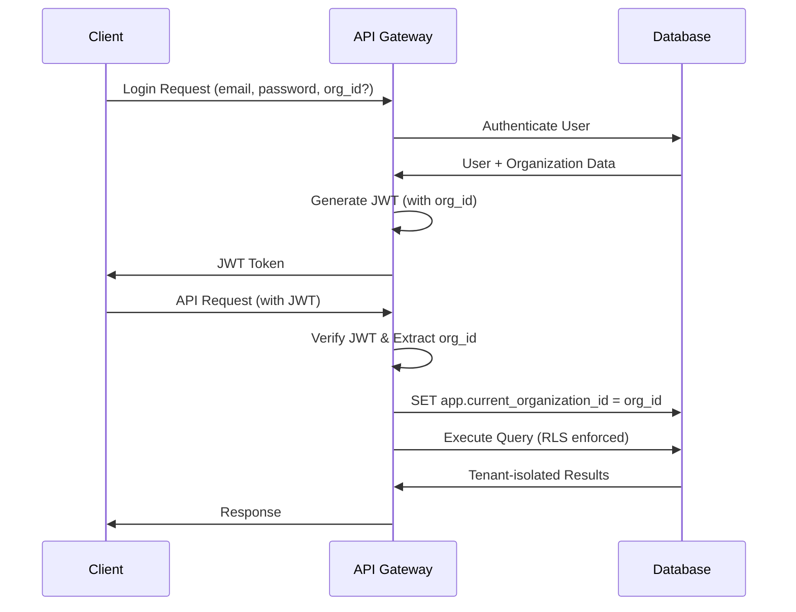

# UnMoGrowP Multi-Tenant Architecture Documentation

**Version:** 0.5.0
**Date:** 2025-10-22
**Status:** Implementation Ready

## 🎯 Executive Summary

UnMoGrowP Attribution Platform now supports a **hybrid multi-tenant/single-tenant architecture** that can serve multiple deployment models from a single codebase. This architecture enables:

- **Shared Infrastructure** with complete data isolation
- **Single-tenant** deployments for enterprise clients
- **Dedicated deployments** for high-security requirements
- **Cross-tenant management** capabilities for MSPs

**Key Benefits:**
- 🔒 **Complete Data Isolation** using Row-Level Security (RLS)
- 🚀 **Scalable** to 1000+ tenants per instance
- 💰 **Cost Efficient** resource sharing
- 🔧 **Flexible** deployment options
- 🛡️ **Enterprise Security** with tenant boundaries

---

## 📋 Table of Contents

- [Architecture Overview](#-architecture-overview)
- [Database Schema](#-database-schema)
- [Authentication & Authorization](#-authentication--authorization)
- [API Implementation](#-api-implementation)
- [Tenant Resolution](#-tenant-resolution)
- [Data Isolation](#-data-isolation)
- [Deployment Models](#-deployment-models)
- [Migration Guide](#-migration-guide)
- [Security Considerations](#-security-considerations)
- [Performance Optimization](#-performance-optimization)
- [Monitoring & Observability](#-monitoring--observability)

---

## 🏗️ Architecture Overview

### Multi-Tenant Architecture Diagram

```
┌─────────────────────────────────────────────────────────────────┐
│                    LOAD BALANCER                                 │
│                   (Nginx/CloudFlare)                            │
└─────────────────────┬───────────────────────────────────────────┘
                      │
┌─────────────────────┴───────────────────────────────────────────┐
│                  API GATEWAY                                     │
│              (Tenant Resolution)                                 │
│   ┌─────────────────────────────────────────────────────────┐   │
│   │  Tenant Resolution Methods:                             │   │
│   │  • Domain-based: client1.unmogrowp.com                 │   │
│   │  • Header-based: X-Organization-ID                     │   │
│   │  • JWT-based: organizationId in token                  │   │
│   └─────────────────────────────────────────────────────────┘   │
└─────────────────────┬───────────────────────────────────────────┘
                      │
┌─────────────────────┴───────────────────────────────────────────┐
│                 APPLICATION LAYER                                │
│                                                                  │
│  ┌──────────────┐  ┌──────────────┐  ┌──────────────┐         │
│  │   Frontend   │  │  API Server  │  │   Backend    │         │
│  │   (Svelte)   │  │ (Bun + tRPC) │  │    (Go)      │         │
│  └──────────────┘  └──────────────┘  └──────────────┘         │
└─────────────────────┬───────────────────────────────────────────┘
                      │
┌─────────────────────┴───────────────────────────────────────────┐
│                  DATABASE LAYER                                  │
│                 (Row-Level Security)                             │
│                                                                  │
│  ┌──────────────┐  ┌──────────────┐  ┌──────────────┐         │
│  │ PostgreSQL   │  │  ClickHouse  │  │    Redis     │         │
│  │   (OLTP)     │  │   (OLAP)     │  │   (Cache)    │         │
│  │              │  │              │  │              │         │
│  │ ┌─────────┐  │  │ ┌─────────┐  │  │ ┌─────────┐  │         │
│  │ │Tenant A │  │  │ │Tenant A │  │  │ │Tenant A │  │         │
│  │ │Tenant B │  │  │ │Tenant B │  │  │ │Tenant B │  │         │
│  │ │Tenant C │  │  │ │Tenant C │  │  │ │Tenant C │  │         │
│  │ └─────────┘  │  │ └─────────┘  │  │ └─────────┘  │         │
│  └──────────────┘  └──────────────┘  └──────────────┘         │
└─────────────────────────────────────────────────────────────────┘
```

### Tenant Isolation Layers

1. **Application Layer Isolation**: JWT tokens contain `organizationId`
2. **Database Layer Isolation**: Row-Level Security (RLS) policies
3. **API Layer Isolation**: All queries scoped by `organization_id`
4. **Cache Layer Isolation**: Redis keys prefixed with `org:{id}:`

---

## 🗃️ Database Schema

### Core Multi-Tenant Tables

#### 1. Organizations Table (Top-level Tenants)

```sql
CREATE TABLE organizations (
    id UUID PRIMARY KEY DEFAULT uuid_generate_v4(),
    name VARCHAR(255) NOT NULL,
    domain VARCHAR(255), -- For subdomain routing
    plan_type VARCHAR(50) DEFAULT 'starter' CHECK (plan_type IN ('starter', 'pro', 'enterprise', 'dedicated')),
    max_apps INTEGER DEFAULT 3,
    max_events_per_month BIGINT DEFAULT 1000000,
    status VARCHAR(50) DEFAULT 'active' CHECK (status IN ('active', 'suspended', 'canceled')),

    -- Multi-tenant settings
    tenant_type VARCHAR(50) DEFAULT 'multi' CHECK (tenant_type IN ('multi', 'single', 'dedicated')),
    database_name VARCHAR(255), -- For single-tenant deployments

    -- Billing & usage
    current_month_events BIGINT DEFAULT 0,
    billing_email VARCHAR(255),
    subscription_id VARCHAR(255),

    created_at TIMESTAMP DEFAULT CURRENT_TIMESTAMP,
    updated_at TIMESTAMP DEFAULT CURRENT_TIMESTAMP,
    last_active_at TIMESTAMP DEFAULT CURRENT_TIMESTAMP
);
```

#### 2. Users Table (Tenant-Isolated)

```sql
CREATE TABLE users (
    id UUID PRIMARY KEY DEFAULT uuid_generate_v4(),
    organization_id UUID REFERENCES organizations(id) ON DELETE CASCADE,

    email VARCHAR(255) NOT NULL,
    password_hash VARCHAR(255) NOT NULL,
    name VARCHAR(255) NOT NULL,
    role VARCHAR(50) DEFAULT 'user' CHECK (role IN ('owner', 'admin', 'user', 'viewer')),
    permissions JSONB DEFAULT '{}',

    email_verified BOOLEAN DEFAULT false,
    status VARCHAR(50) DEFAULT 'active' CHECK (status IN ('active', 'suspended', 'pending')),

    created_at TIMESTAMP DEFAULT CURRENT_TIMESTAMP,
    updated_at TIMESTAMP DEFAULT CURRENT_TIMESTAMP,
    last_login_at TIMESTAMP,

    -- Unique email per organization
    UNIQUE(organization_id, email)
);

-- Global email uniqueness index (for cross-tenant scenarios)
CREATE UNIQUE INDEX idx_users_email_global ON users(email) WHERE status = 'active';
```

#### 3. Apps Table (Tenant-Isolated)

```sql
CREATE TABLE apps (
    id UUID PRIMARY KEY DEFAULT uuid_generate_v4(),
    organization_id UUID REFERENCES organizations(id) ON DELETE CASCADE,
    user_id UUID REFERENCES users(id) ON DELETE CASCADE,

    name VARCHAR(255) NOT NULL,
    bundle_id VARCHAR(255) NOT NULL,
    platform VARCHAR(50) NOT NULL CHECK (platform IN ('ios', 'android', 'web', 'unity')),

    api_key VARCHAR(255) UNIQUE NOT NULL,
    api_secret VARCHAR(255) NOT NULL,
    webhook_url VARCHAR(500),

    settings JSONB DEFAULT '{}',
    status VARCHAR(50) DEFAULT 'active' CHECK (status IN ('active', 'paused', 'archived')),

    attribution_window_hours INTEGER DEFAULT 168, -- 7 days
    view_through_window_hours INTEGER DEFAULT 24,  -- 1 day

    created_at TIMESTAMP DEFAULT CURRENT_TIMESTAMP,
    updated_at TIMESTAMP DEFAULT CURRENT_TIMESTAMP,

    -- Unique bundle_id per organization
    UNIQUE(organization_id, bundle_id)
);
```

### Row-Level Security (RLS) Implementation

```sql
-- Enable RLS on all tenant-aware tables
ALTER TABLE organizations ENABLE ROW LEVEL SECURITY;
ALTER TABLE users ENABLE ROW LEVEL SECURITY;
ALTER TABLE apps ENABLE ROW LEVEL SECURITY;

-- Create tenant isolation policies
CREATE POLICY tenant_isolation ON users
    FOR ALL USING (organization_id = current_setting('app.current_organization_id')::UUID);

CREATE POLICY tenant_isolation ON apps
    FOR ALL USING (organization_id = current_setting('app.current_organization_id')::UUID);
```

### ClickHouse Multi-Tenant Schema

```sql
-- Events table with tenant isolation
CREATE TABLE events (
    organization_id String,
    app_id String,

    id UUID DEFAULT generateUUIDv4(),
    event_type String,
    user_id Nullable(String),
    device_id String,

    -- Event data...
    properties String DEFAULT '{}',
    revenue Nullable(Float64),

    event_timestamp DateTime64(3) DEFAULT now64(3),
    date Date DEFAULT toDate(event_timestamp)

) ENGINE = MergeTree()
PARTITION BY (organization_id, toYYYYMM(date))
ORDER BY (organization_id, app_id, event_type, event_timestamp);
```

---

## 🔐 Authentication & Authorization

### Multi-Tenant JWT Structure

```typescript
interface JWTPayload {
  userId: string;
  organizationId: string;
  email: string;
  name: string;
  role: 'owner' | 'admin' | 'user' | 'viewer';
  permissions: Record<string, any>;
  apps: string[]; // App IDs user has access to
}
```

### Role-Based Access Control (RBAC)

| Role | Permissions |
|------|-------------|
| **Owner** | Full organization access, billing, user management |
| **Admin** | App management, user management (except owner), analytics |
| **User** | App creation, own apps management, analytics |
| **Viewer** | Read-only access to assigned apps |

### API Authentication Flow



---

## 🔌 API Implementation

### Tenant-Aware Database Service

```typescript
export class MultiTenantAuthService {
  // Set tenant context for all subsequent queries
  static async setTenantContext(client: PoolClient, organizationId: string): Promise<void> {
    await client.query('SET LOCAL app.current_organization_id = $1', [organizationId]);
  }

  // Authenticate user with tenant resolution
  static async authenticateUser(
    email: string,
    password: string,
    organizationId?: string
  ): Promise<User | null> {
    const client = await pool.connect();

    try {
      let query: string;
      if (organizationId) {
        // Login to specific organization
        query = `SELECT u.*, o.name as org_name
                FROM users u JOIN organizations o ON u.organization_id = o.id
                WHERE u.email = $1 AND u.organization_id = $2`;
      } else {
        // Find user across organizations
        query = `SELECT u.*, o.name as org_name
                FROM users u JOIN organizations o ON u.organization_id = o.id
                WHERE u.email = $1 ORDER BY u.last_login_at DESC LIMIT 1`;
      }

      const result = await client.query(query, organizationId ? [email, organizationId] : [email]);
      // ... authentication logic
    } finally {
      client.release();
    }
  }
}
```

### API Middleware for Tenant Resolution

```typescript
// Tenant resolution middleware
app.use(async (c, next) => {
  const organization = await MultiTenantAuthService.resolveTenant(c.req);

  if (organization) {
    c.set('organization', organization);
  }

  await next();
});

// Authentication middleware with tenant context
app.use(async (c, next) => {
  const token = c.req.header('Authorization')?.replace('Bearer ', '');

  if (token) {
    try {
      const payload = MultiTenantAuthService.verifyToken(token);
      c.set('user', payload);
      c.set('organizationId', payload.organizationId);
    } catch (error) {
      return c.json({ error: 'Invalid token' }, 401);
    }
  }

  await next();
});
```

---

## 🎯 Tenant Resolution

### Multiple Resolution Methods

#### 1. Domain-Based Resolution

```
https://client1.unmogrowp.com/api/auth/login
https://acme-corp.unmogrowp.com/dashboard
```

#### 2. Header-Based Resolution

```bash
curl -H "X-Organization-ID: org_123" https://api.unmogrowp.com/dashboard/stats
```

#### 3. JWT-Based Resolution

```typescript
// JWT payload contains organizationId
{
  "userId": "user_123",
  "organizationId": "org_456",
  "email": "user@client1.com"
}
```

#### 4. Path-Based Resolution

```
https://api.unmogrowp.com/org/client1/dashboard/stats
```

### Tenant Resolution Priority

1. **X-Organization-ID Header** (highest priority)
2. **JWT Token organizationId**
3. **Subdomain extraction**
4. **Domain exact match**
5. **Path-based organization**

---

## 🔒 Data Isolation

### Row-Level Security (RLS) Enforcement

Every tenant-aware table includes:

```sql
-- 1. Organization ID column
organization_id UUID REFERENCES organizations(id) ON DELETE CASCADE

-- 2. RLS Policy
CREATE POLICY tenant_isolation ON table_name
    FOR ALL USING (organization_id = current_setting('app.current_organization_id')::UUID);

-- 3. Indexes for performance
CREATE INDEX idx_table_name_organization_id ON table_name(organization_id);
```

### Query Examples with Tenant Isolation

```typescript
// ❌ WRONG - No tenant isolation
const users = await client.query('SELECT * FROM users');

// ✅ CORRECT - Tenant isolation enforced
const client = await pool.connect();
await MultiTenantAuthService.setTenantContext(client, organizationId);
const users = await client.query('SELECT * FROM users'); // RLS enforced
```

### Cache Isolation

```typescript
// Redis keys with tenant prefix
const cacheKey = `org:${organizationId}:dashboard:stats`;
const userKey = `org:${organizationId}:user:${userId}:profile`;
```

---

## 🚀 Deployment Models

### 1. Shared Multi-Tenant (Default)

**Description**: Multiple tenants share the same database and application instance.

**Configuration**:
```yaml
deployment_type: shared_multi_tenant
max_tenants_per_instance: 1000
resource_sharing: true
isolation_level: row_level_security
```

**Use Cases**:
- SaaS startups
- Small to medium businesses
- Cost-conscious deployments

### 2. Single-Tenant (Enterprise)

**Description**: Each tenant gets a dedicated database or application instance.

**Configuration**:
```yaml
deployment_type: single_tenant
database_per_tenant: true
dedicated_resources: true
isolation_level: database_level
```

**Use Cases**:
- Enterprise clients
- Compliance requirements (HIPAA, SOC2)
- High-security environments

### 3. Dedicated Infrastructure

**Description**: Complete infrastructure isolation per tenant.

**Configuration**:
```yaml
deployment_type: dedicated
infrastructure_isolation: true
dedicated_vpc: true
dedicated_cluster: true
```

**Use Cases**:
- Fortune 500 companies
- Government contracts
- Ultra-high security requirements

### 4. Hybrid Deployment

**Description**: Mix of deployment models based on tenant plan.

```typescript
// Tenant routing based on plan type
const deploymentModel = organization.tenant_type;

switch (deploymentModel) {
  case 'multi':
    return sharedDatabaseConnection;
  case 'single':
    return dedicatedDatabaseConnection(organization.database_name);
  case 'dedicated':
    return dedicatedInfrastructureConnection(organization.id);
}
```

---

## 📈 Migration Guide

### Phase 1: Schema Migration

```sql
-- 1. Backup existing data
pg_dump unmogrowp > unmogrowp_backup_pre_multi_tenant.sql

-- 2. Create multi-tenant schema
\i database/multi-tenant-schema.sql

-- 3. Create default organization for existing data
INSERT INTO organizations (id, name, plan_type)
VALUES ('default_org', 'Default Organization', 'enterprise');

-- 4. Add organization_id to existing users
ALTER TABLE users ADD COLUMN organization_id UUID REFERENCES organizations(id);
UPDATE users SET organization_id = 'default_org';
ALTER TABLE users ALTER COLUMN organization_id SET NOT NULL;

-- 5. Enable RLS
ALTER TABLE users ENABLE ROW LEVEL SECURITY;
CREATE POLICY tenant_isolation ON users FOR ALL
USING (organization_id = current_setting('app.current_organization_id')::UUID);
```

### Phase 2: Application Migration

```typescript
// 1. Replace AuthService with MultiTenantAuthService
import { MultiTenantAuthService } from './multi-tenant-database';

// 2. Update all database queries to use tenant context
const authenticateUser = async (email: string, password: string) => {
  return await MultiTenantAuthService.authenticateUser(email, password);
};

// 3. Update JWT token generation
const generateToken = (user: User) => {
  return MultiTenantAuthService.generateToken(user, false);
};
```

### Phase 3: Frontend Migration

```typescript
// 1. Update login form to optionally include organization
interface LoginForm {
  email: string;
  password: string;
  organizationId?: string; // Optional for multi-tenant
}

// 2. Update API client to include organization context
const apiClient = createTRPCClient({
  headers: {
    'X-Organization-ID': user.organizationId,
  },
});
```

---

## 🛡️ Security Considerations

### 1. Tenant Boundary Enforcement

**RLS Validation**:
```sql
-- Test RLS isolation
SET app.current_organization_id = 'org_A';
SELECT COUNT(*) FROM users; -- Should only return org_A users

SET app.current_organization_id = 'org_B';
SELECT COUNT(*) FROM users; -- Should only return org_B users
```

**Application-Level Validation**:
```typescript
// Always validate organizationId in API requests
const validateTenantAccess = (userOrgId: string, requestedOrgId: string) => {
  if (userOrgId !== requestedOrgId) {
    throw new Error('Unauthorized: Cross-tenant access denied');
  }
};
```

### 2. Data Leakage Prevention

**Query Validation**:
```typescript
// ❌ DANGEROUS - Direct query without tenant context
const getUsers = async () => {
  return await pool.query('SELECT * FROM users');
};

// ✅ SAFE - Tenant context enforced
const getUsers = async (organizationId: string) => {
  const client = await pool.connect();
  await setTenantContext(client, organizationId);
  return await client.query('SELECT * FROM users');
};
```

### 3. Cross-Tenant Attack Prevention

**Input Validation**:
```typescript
// Validate all organization IDs against user permissions
const validateOrganizationAccess = async (userId: string, organizationId: string) => {
  const user = await getUserById(userId);
  if (user.organization_id !== organizationId) {
    throw new Error('Forbidden: Organization access denied');
  }
};
```

---

## ⚡ Performance Optimization

### 1. Database Optimization

**Partitioning Strategy**:
```sql
-- Partition large tables by organization
CREATE TABLE events_partitioned (
    organization_id UUID NOT NULL,
    -- other columns...
) PARTITION BY HASH (organization_id);

-- Create partitions
CREATE TABLE events_org_0 PARTITION OF events_partitioned
    FOR VALUES WITH (MODULUS 4, REMAINDER 0);
```

**Indexing Strategy**:
```sql
-- Composite indexes with organization_id as first column
CREATE INDEX idx_users_org_email ON users(organization_id, email);
CREATE INDEX idx_apps_org_status ON apps(organization_id, status);
CREATE INDEX idx_events_org_timestamp ON events(organization_id, event_timestamp);
```

### 2. Caching Strategy

**Tenant-Aware Redis**:
```typescript
// Cache with tenant isolation
class MultiTenantCache {
  static async get(organizationId: string, key: string) {
    const tenantKey = `org:${organizationId}:${key}`;
    return await redis.get(tenantKey);
  }

  static async set(organizationId: string, key: string, value: any, ttl: number = 300) {
    const tenantKey = `org:${organizationId}:${key}`;
    return await redis.setex(tenantKey, ttl, JSON.stringify(value));
  }
}
```

### 3. Connection Pooling

```typescript
// Tenant-aware connection pooling
const tenantPools = new Map<string, Pool>();

const getTenantPool = (organizationId: string): Pool => {
  if (!tenantPools.has(organizationId)) {
    tenantPools.set(organizationId, new Pool({
      // Database configuration for tenant
      database: getTenantDatabase(organizationId),
      max: 10, // Connections per tenant
    }));
  }
  return tenantPools.get(organizationId)!;
};
```

---

## 📊 Monitoring & Observability

### 1. Tenant Metrics

**Key Performance Indicators**:
- Tenant-specific request rates
- Database query performance per tenant
- Resource utilization by organization
- Cross-tenant data isolation validation

**Monitoring Queries**:
```sql
-- Tenant activity monitoring
SELECT
    o.name,
    COUNT(DISTINCT u.id) as active_users,
    COUNT(DISTINCT a.id) as total_apps,
    o.current_month_events,
    o.last_active_at
FROM organizations o
LEFT JOIN users u ON o.id = u.organization_id AND u.status = 'active'
LEFT JOIN apps a ON o.id = a.organization_id AND a.status = 'active'
GROUP BY o.id, o.name
ORDER BY o.last_active_at DESC;
```

### 2. Security Monitoring

**RLS Audit Queries**:
```sql
-- Verify RLS is enabled on all tenant tables
SELECT schemaname, tablename, rowsecurity
FROM pg_tables
WHERE schemaname = 'public'
  AND tablename IN ('users', 'apps', 'user_sessions');

-- Monitor cross-tenant access attempts
SELECT
    user_id,
    organization_id,
    COUNT(*) as failed_attempts,
    MAX(created_at) as last_attempt
FROM security_audit_log
WHERE event_type = 'cross_tenant_access_denied'
  AND created_at > NOW() - INTERVAL '24 hours'
GROUP BY user_id, organization_id;
```

### 3. Performance Monitoring

**Grafana Dashboard Queries**:
```sql
-- Tenant resource usage
SELECT
    organization_id,
    AVG(query_duration_ms) as avg_query_time,
    COUNT(*) as total_queries,
    SUM(CASE WHEN query_duration_ms > 1000 THEN 1 ELSE 0 END) as slow_queries
FROM query_performance_log
WHERE timestamp > NOW() - INTERVAL '1 hour'
GROUP BY organization_id;
```

---

## 🔄 Backup & Recovery

### Multi-Tenant Backup Strategy

**Organization-Level Backups**:
```bash
# Backup specific organization data
pg_dump -t users -t apps -t user_sessions \
    --where="organization_id='org_123'" \
    unmogrowp > org_123_backup.sql
```

**Point-in-Time Recovery**:
```sql
-- Restore organization to specific timestamp
SELECT pg_create_restore_point('before_org_123_migration');

-- Selective restore
RESTORE DATABASE unmogrowp FROM BACKUP
WHERE organization_id = 'org_123'
AS OF SYSTEM TIME '2025-10-22 10:30:00';
```

---

## 🎛️ Configuration

### Environment Variables

```bash
# Multi-tenant configuration
TENANT_MODE=multi  # multi, single, dedicated
MAX_TENANTS_PER_INSTANCE=1000
ENABLE_CROSS_TENANT_ACCESS=false
RLS_ENFORCEMENT=strict

# Database configuration
DB_CONNECTION_POOL_SIZE_PER_TENANT=10
DB_ENABLE_PARTITIONING=true
DB_PARTITION_STRATEGY=hash

# Security configuration
JWT_INCLUDE_ORGANIZATION_ID=true
ENFORCE_TENANT_ISOLATION=true
LOG_CROSS_TENANT_ATTEMPTS=true

# Performance configuration
CACHE_TENANT_ISOLATION=true
REDIS_KEY_PREFIX_TENANT=true
ENABLE_QUERY_TENANT_VALIDATION=true
```

### Deployment Configuration

```yaml
# docker-compose.yml
version: '3.8'
services:
  api:
    environment:
      - TENANT_MODE=multi
      - MAX_TENANTS_PER_INSTANCE=1000
      - RLS_ENFORCEMENT=strict
    volumes:
      - ./config/multi-tenant.env:/app/.env

  database:
    environment:
      - POSTGRES_MULTIPLE_DATABASES=true
      - POSTGRES_ENABLE_RLS=true
    volumes:
      - ./database/multi-tenant-schema.sql:/docker-entrypoint-initdb.d/01-multi-tenant.sql
```

---

## 📚 API Reference

### Authentication Endpoints

```typescript
// Multi-tenant login
POST /api/auth/login
{
  "email": "user@client.com",
  "password": "password",
  "organizationId": "org_123" // optional
}

// Organization registration
POST /api/auth/register
{
  "email": "admin@newclient.com",
  "password": "password",
  "name": "Admin User",
  "organizationName": "New Client Corp"
}

// Cross-tenant user search (owner/admin only)
GET /api/admin/users/search?email=user@domain.com
Headers: { "X-Organization-ID": "org_123" }
```

### Organization Management

```typescript
// Get organization details
GET /api/organizations/current
Headers: { "Authorization": "Bearer JWT_TOKEN" }

// Update organization settings
PUT /api/organizations/current
{
  "name": "Updated Org Name",
  "settings": {
    "timezone": "UTC",
    "data_retention_days": 365
  }
}

// Get organization usage
GET /api/organizations/current/usage
Response: {
  "current_month_events": 50000,
  "max_events_per_month": 1000000,
  "active_apps": 5,
  "active_users": 12
}
```

---

## 🔮 Future Enhancements

### Phase 2 Roadmap

1. **Advanced Tenant Management**
   - Tenant provisioning automation
   - Resource quota enforcement
   - Billing integration

2. **Cross-Tenant Analytics**
   - Aggregated reporting across tenants
   - Benchmark analytics
   - Multi-tenant dashboard

3. **Advanced Security**
   - Tenant-specific encryption keys
   - Advanced audit logging
   - Compliance reporting (SOC2, HIPAA)

4. **Performance Optimization**
   - Automatic tenant load balancing
   - Smart query optimization
   - Predictive scaling

---

## 💡 Best Practices

### Development Guidelines

1. **Always Use Tenant Context**
   ```typescript
   // ✅ Good
   const getUserData = async (userId: string, organizationId: string) => {
     const client = await pool.connect();
     await setTenantContext(client, organizationId);
     return await client.query('SELECT * FROM users WHERE id = $1', [userId]);
   };
   ```

2. **Validate Tenant Access**
   ```typescript
   // ✅ Good
   const validateTenantAccess = (userOrgId: string, resourceOrgId: string) => {
     if (userOrgId !== resourceOrgId) {
       throw new UnauthorizedError('Cross-tenant access denied');
     }
   };
   ```

3. **Use Tenant-Aware Caching**
   ```typescript
   // ✅ Good
   const cacheKey = `org:${organizationId}:user:${userId}`;
   ```

### Testing Guidelines

1. **Tenant Isolation Tests**
   ```typescript
   describe('Tenant Isolation', () => {
     it('should not access other tenant data', async () => {
       const org1Users = await getUsers('org_1');
       const org2Users = await getUsers('org_2');

       expect(org1Users).not.toContainEqual(expect.objectContaining({
         organization_id: 'org_2'
       }));
     });
   });
   ```

---

## 📞 Support & Migration

For support with multi-tenant implementation:

1. **Review Migration Checklist** in this document
2. **Test RLS Policies** before production deployment
3. **Monitor Tenant Isolation** using provided queries
4. **Validate Performance Impact** with load testing

**Contact**: Technical implementation support available for enterprise clients.

---

*This documentation is maintained as part of the UnMoGrowP Attribution Platform v0.5.0 multi-tenant architecture implementation.*