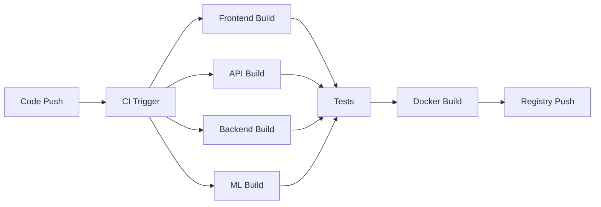

# 🔧 Build & CI/CD Infrastructure Enhancement

**Title**: `[INFRA] Build & CI/CD Infrastructure Enhancement - Production-Ready Pipeline`

**Labels**: `infrastructure`, `ci-cd`, `build`, `production`, `high-priority`

**Component**: ci-cd, infrastructure, deployment

**Assignee**: @kik200771-oss

---

## 📋 Overview

Enhance the existing CI/CD infrastructure to support production-ready builds, deployments, and monitoring for the UnMoGrowP Attribution Platform across all components.

## 🎯 Current CI/CD Assessment

### ✅ Existing Infrastructure (Strong Foundation)
```yaml
# .github/workflows/ci.yml (691 lines)
✅ Frontend (Svelte 5) - Build, test, lint
✅ API Gateway (Bun + Hono) - Build, test, performance
✅ Backend (Go) - Build, test, race detection
✅ ML Services (Python) - Build, test, model validation
✅ Security Scanning - Trivy, dependency check
✅ Performance Testing - Load tests, benchmarks
✅ Docker Compose - Multi-service integration
✅ Kubernetes Validation - Manifest validation
```

### ✅ Release Workflow
```yaml
# .github/workflows/release.yml (270 lines)
✅ Semantic versioning automation
✅ Docker builds and GHCR publishing
✅ Security scanning integration
✅ Staging deployment pipeline
✅ Automated changelog generation
```

## 🚀 Enhancement Requirements

### 1. Build Optimization
- [ ] **Multi-Stage Docker Builds**
  - [ ] Optimize frontend build (reduce 50MB+ images)
  - [ ] Go binary optimization (scratch/distroless images)
  - [ ] Python ML service optimization
  - [ ] Build cache strategy implementation

- [ ] **Build Performance**
  - [ ] Parallel build execution
  - [ ] Build cache optimization
  - [ ] Dependency caching strategy
  - [ ] Build time monitoring (<5 minutes total)

### 2. Testing Enhancement
- [ ] **Test Coverage Improvement**
  - [ ] Frontend: >90% component coverage
  - [ ] Backend: >95% unit test coverage
  - [ ] Integration: End-to-end API tests
  - [ ] Performance: Automated benchmark regression

- [ ] **Test Environment Management**
  - [ ] Isolated test databases (PostgreSQL/ClickHouse)
  - [ ] Test data seeding automation
  - [ ] Parallel test execution
  - [ ] Test result reporting & history

### 3. Deployment Pipeline
- [ ] **Environment Management**
  - [ ] Development environment (auto-deploy from feature branches)
  - [ ] Staging environment (auto-deploy from main)
  - [ ] Production environment (manual approval process)
  - [ ] Review apps (PR-based environments)

- [ ] **Deployment Strategies**
  - [ ] Blue-green deployment for zero-downtime
  - [ ] Canary releases for gradual rollout
  - [ ] Automatic rollback on failure detection
  - [ ] Health check integration

### 4. Monitoring & Observability
- [ ] **Build Monitoring**
  - [ ] Build success/failure rates
  - [ ] Build duration tracking
  - [ ] Resource utilization monitoring
  - [ ] Cost optimization tracking

- [ ] **Deployment Monitoring**
  - [ ] Deployment success rates
  - [ ] Rollback frequency tracking
  - [ ] Performance impact analysis
  - [ ] Customer impact monitoring

## 🏗️ Architecture Improvements

### Current Build Architecture


### Enhanced Build Architecture

```mermaid
graph LR
    A[Code Push] --> B[CI Trigger]
    B --> C[Parallel Builds]
    C --> D[Frontend + API + Backend + ML]
    D --> E[Parallel Tests]
    E --> F[Security Scan]
    F --> G[Performance Tests]
    G --> H[Multi-Arch Docker]
    H --> I[Registry + Staging]
    I --> J[Auto Deploy]
    J --> K[Health Checks]
    K --> L[Production Ready]
```


## 🔧 Technical Implementation

### 1. Docker Build Optimization
```dockerfile
# Multi-stage builds for each service
FROM node:20-alpine AS frontend-build
# ... optimized frontend build

FROM golang:1.21-alpine AS backend-build
# ... optimized Go build

FROM python:3.11-slim AS ml-build
# ... optimized ML service build

FROM scratch AS final
# Minimal production images
```

### 2. Build Cache Strategy
```yaml
# Enhanced cache configuration
- name: Cache Dependencies
  uses: actions/cache@v3
  with:
    path: |
      ~/.npm
      ~/.cache/go-build
      ~/.cache/pip
      node_modules
      vendor
    key: ${{ runner.os }}-deps-${{ hashFiles('**/*.lock') }}
```

### 3. Parallel Execution Matrix
```yaml
strategy:
  matrix:
    component: [frontend, api-gateway, backend, ml-services]
    environment: [development, staging, production]
  max-parallel: 4
```

## 📊 Performance Targets

### Build Performance
- **Total Build Time**: <5 minutes (currently ~8 minutes)
- **Docker Build**: <3 minutes per service
- **Test Execution**: <2 minutes per component
- **Security Scan**: <1 minute

### Deployment Performance
- **Staging Deployment**: <3 minutes
- **Production Deployment**: <5 minutes
- **Rollback Time**: <1 minute
- **Health Check**: <30 seconds

### Resource Optimization
- **Docker Image Size**: Reduce by 60%
  - Frontend: 150MB → 60MB
  - Backend: 20MB → 8MB
  - ML Services: 800MB → 300MB
- **Build Cache Hit Rate**: >80%
- **Parallel Execution**: 4x concurrent builds

## 🔐 Security Enhancements

### 1. Build Security
- [ ] **Dependency Scanning**
  - [ ] Automated vulnerability detection
  - [ ] License compliance checking
  - [ ] Supply chain security validation
  - [ ] SBOM (Software Bill of Materials) generation

- [ ] **Image Security**
  - [ ] Multi-architecture builds (amd64, arm64)
  - [ ] Minimal base images (distroless/scratch)
  - [ ] Image signing and verification
  - [ ] Runtime security scanning

### 2. Secret Management
- [ ] **Build Secrets**
  - [ ] GitHub Secrets for sensitive data
  - [ ] Environment-specific configurations
  - [ ] API key rotation automation
  - [ ] Secure artifact storage

- [ ] **Deployment Secrets**
  - [ ] Kubernetes secret management
  - [ ] Database credential rotation
  - [ ] Certificate management
  - [ ] External service authentication

## 🌍 Environment Configuration

### Development Environment
```yaml
# Auto-deploy from feature branches
trigger: feature/*
environment: development
approval: none
monitoring: basic
retention: 3 days
```

### Staging Environment
```yaml
# Auto-deploy from main branch
trigger: main
environment: staging
approval: none
monitoring: comprehensive
retention: 30 days
```

### Production Environment
```yaml
# Manual deployment with approval
trigger: release/v*
environment: production
approval: required (2 reviewers)
monitoring: full observability
retention: permanent
```

## 📈 Success Metrics

### Build Quality
- **Build Success Rate**: >98%
- **Test Coverage**: >90% across all components
- **Security Scan Pass Rate**: 100%
- **Performance Regression**: 0 critical issues

### Deployment Quality
- **Deployment Success Rate**: >99%
- **Zero-Downtime Deployments**: 100%
- **Rollback Time**: <1 minute
- **Mean Time to Recovery**: <5 minutes

### Developer Experience
- **Build Feedback Time**: <5 minutes
- **PR Review Time**: <24 hours
- **Feature Delivery Time**: <1 week
- **Hotfix Deployment**: <30 minutes

## 🔄 Implementation Plan

### Phase 1: Build Optimization (Week 1)
- [ ] Implement multi-stage Docker builds
- [ ] Optimize build caching
- [ ] Enhance parallel execution
- [ ] Performance monitoring setup

### Phase 2: Testing Enhancement (Week 2)
- [ ] Improve test coverage
- [ ] Implement isolated test environments
- [ ] Performance regression testing
- [ ] Test result reporting

### Phase 3: Deployment Pipeline (Week 3)
- [ ] Environment management
- [ ] Blue-green deployment
- [ ] Health check integration
- [ ] Automated rollback

### Phase 4: Monitoring & Security (Week 4)
- [ ] Comprehensive monitoring
- [ ] Security scanning enhancement
- [ ] Secret management
- [ ] Documentation & training

## 🎯 Acceptance Criteria

### Technical Requirements
- [ ] Build time reduced to <5 minutes
- [ ] Docker images optimized (60% size reduction)
- [ ] Test coverage >90% across all components
- [ ] Zero-downtime deployment capability
- [ ] Automated rollback functionality

### Business Requirements
- [ ] Faster feature delivery (<1 week cycle)
- [ ] Improved system reliability (>99.9% uptime)
- [ ] Enhanced security posture
- [ ] Cost optimization (resource efficiency)
- [ ] Better developer experience

## 🔗 Dependencies

### Internal Dependencies
- **Issue #XXX**: Svelte 5 Migration (frontend build updates)
- **Issue #XXX**: Security & Secrets (secret management)
- Database schemas (build validation)
- Customer success metrics (deployment validation)

### External Dependencies
- GitHub Actions capabilities
- Docker Hub / GHCR access
- Kubernetes cluster access
- Monitoring infrastructure

## 📚 Resources

### Documentation
- [GitHub Actions Best Practices](https://docs.github.com/en/actions/learn-github-actions/best-practices-for-github-actions)
- [Docker Multi-stage Builds](https://docs.docker.com/build/building/multi-stage/)
- [Kubernetes Deployment Strategies](https://kubernetes.io/docs/concepts/workloads/controllers/deployment/)

### Internal Resources
- `.github/workflows/ci.yml` - Current CI/CD pipeline
- `.github/workflows/release.yml` - Release automation
- `docker-compose.yml` - Service orchestration
- `deployment/kubernetes/` - K8s manifests

---

**Priority**: High - Critical for production readiness
**Estimated Effort**: 4 weeks
**Risk Level**: Medium - Building on existing strong foundation